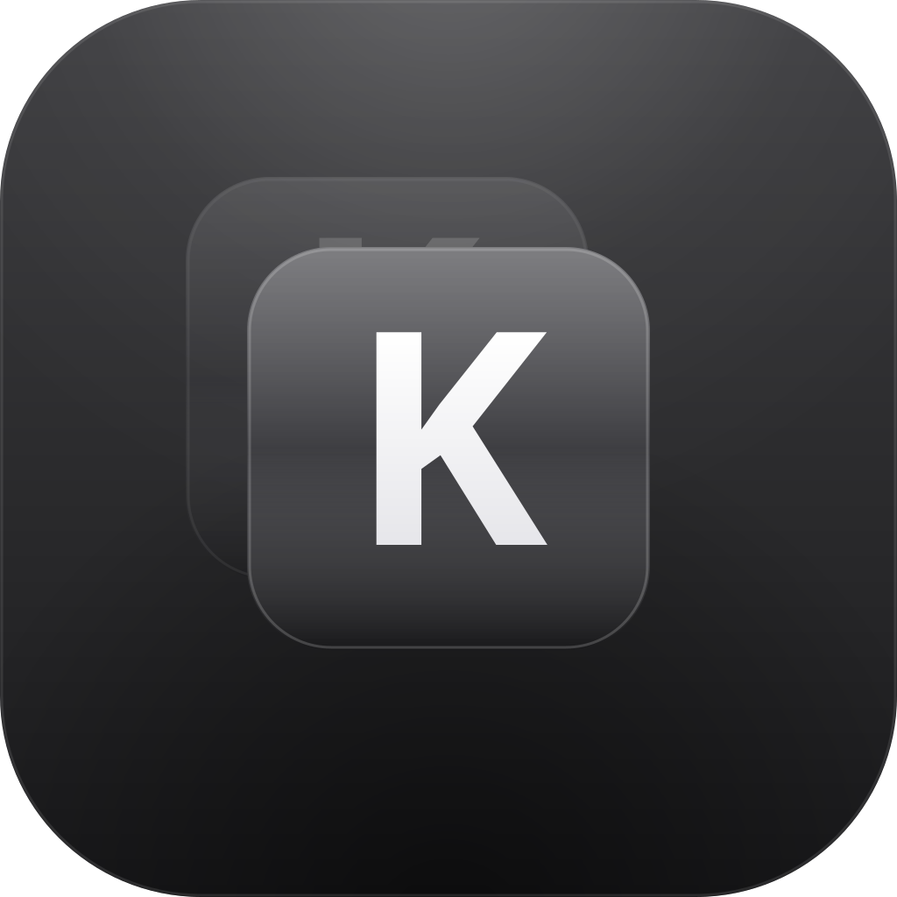
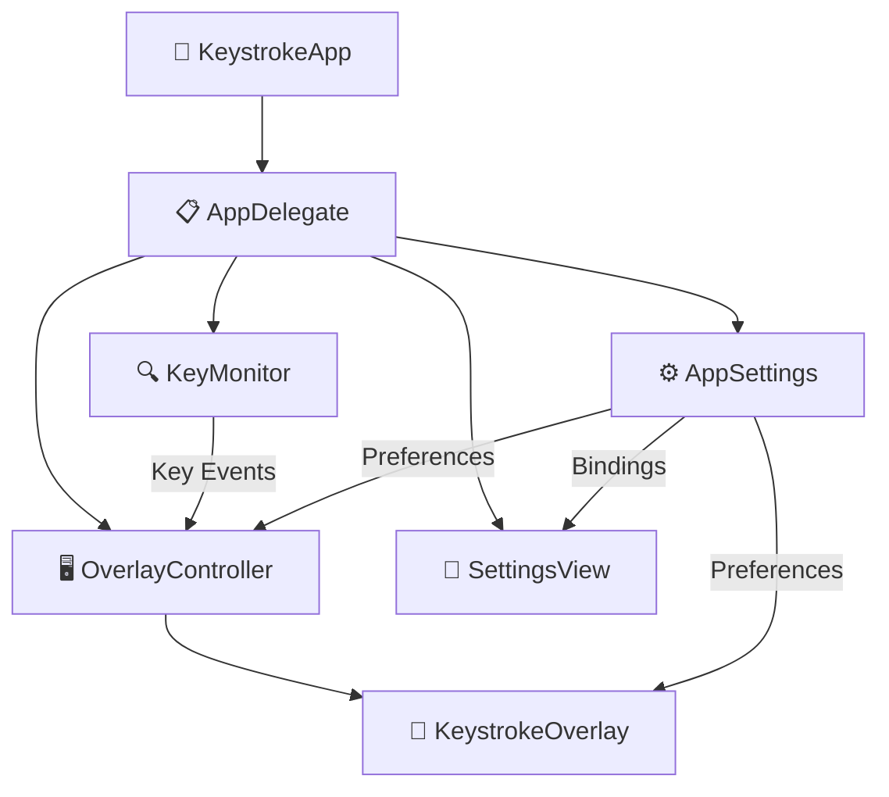

<p align="center">
  
</p>

<h1 align="center">KeystrokeViewer</h1>

<p align="center">
  <strong>A macOS menu bar app that displays your keystrokes as a real-time overlay on screen</strong><br>
  Designed with MacBook Pro keyboard-style key caps
</p>

<p align="center">
  <a href="https://github.com/hgunay/keystroke-viewer/releases/latest"></a>
  
  
  <a href="LICENSE"></a>
</p>

---

## ⚡ Quick Start

> **3 steps to get running:**

```
1. 📦 Download → github.com/hgunay/keystroke-viewer/releases/latest
2. 🚀 Unzip → Drag to Applications → Right-click → Open
3. 🔐 Allow → System Settings → Privacy & Security → Accessibility → Enable
```

---

## ✨ Features

<table>
<tr>
<td width="50%">

### ⌨️ Keystroke Display
- Real-time overlay with MacBook Pro proportions
- Compact combo display — `⌘C`, `⌃⌥⌘K` as single key cap
- Caps Lock indicator with green LED
- Key repeat filtering
- Function keys F1–F15
- Case-aware (uppercase with Caps Lock)
- Password field auto-hide 🔒

</td>
<td width="50%">

### 🎨 Themes & Appearance
- **15 built-in themes** — Dark, Light, Midnight, Ocean, Rosé, Forest, Dracula, Nord, Solarized, Monokai, Catppuccin, GitHub, One Dark, Glass, Glass Light
- Custom color picker
- 5 animation styles — Fade, Slide Up, Scale, Bounce
- 4 font styles — System, Mono, Rounded, Serif
- Adjustable size, scale & opacity

</td>
</tr>
<tr>
<td width="50%">

### 🖱️ Mouse & Sound
- Click visualization with ripple animations
- Distinct colors for left, right & middle click
- Scroll indicator
- **8 sound profiles** — Cherry MX Blue/Brown/Red, Topre, Buckling Spring, Typewriter, Bubble Pop, Minimal Tap
- Output device selection & volume control

</td>
<td width="50%">

### 🎯 Presets & Layout
- **6 quick presets** — Presentation, Coding, Streaming, Minimal, Typewriter, Mechanical
- Save/load custom presets
- 7 overlay positions (corners, edges, center)
- Multi-monitor support (main, all, follow active)
- Configurable key groups
- Launch at login

</td>
</tr>
</table>

---

## 📦 Installation

### Option 1: Download Release (Recommended)

1. Download `KeystrokeViewer.zip` from the [**latest release**](https://github.com/hgunay/keystroke-viewer/releases/latest)

2. Unzip and drag `KeystrokeViewer.app` to your **Applications** folder

3. On first launch, macOS will show a security warning (the app is ad-hoc signed but not notarized):

   > 💡 **Right-click** the app → **Open** → click **Open** again
   >
   > Or: **System Settings → Privacy & Security** → scroll down → **Open Anyway**

4. Grant **Accessibility** permission:

   > **System Settings → Privacy & Security → Accessibility** → Enable **KeystrokeViewer**

5. Restart the app. A ⌨️ icon appears in the menu bar — start typing!

### Option 2: Build from Source

```bash
git clone https://github.com/hgunay/keystroke-viewer.git
cd keystroke-viewer
open KeystrokeViewer.xcodeproj
# Build & Run (⌘R) — Requires Xcode 15+
```

---

## 🚀 Usage

### Menu Bar

Click the ⌨️ icon in the menu bar:

| Action | Description |
|:---:|---|
| 👁️ **Show Overlay** | Toggle keystroke display on/off |
| ⚙️ **Preferences** | Open the settings window |
| 🚪 **Quit** | Exit the app |

### Global Shortcut

Press **`⌃⌥⌘K`** to toggle the overlay from any app. Customizable in Preferences → General.

---

## ⚙️ Settings

Settings are organized in four tabs:

<details>
<summary><strong>🔧 General</strong></summary>

| Setting | Description |
|---|---|
| **Show overlay** | Toggle keystroke display on/off |
| **Toggle shortcut** | Record a custom global hotkey |
| **Launch at login** | Auto-start when you log in |
| **Mouse clicks** | Ripple animation (left=white, right=blue, middle=orange) |
| **Keystroke sound** | 8 profiles, device selection, volume (10–100%) |
| **Hide in password fields** | Suppress keystrokes in secure input fields |

</details>

<details>
<summary><strong>🎨 Appearance</strong></summary>

| Setting | Description |
|---|---|
| **Theme** | 15 presets or custom color scheme |
| **Custom colors** | Key background & text color picker |
| **Compact combos** | `⌘C` as single key cap vs separate keys |
| **Animation** | None, Fade, Slide Up, Scale, Bounce |
| **Position** | Bottom, Top, Center, or any corner |
| **Screen** | Main Screen, All Screens, Follow Active |
| **Font** | System, Mono, Rounded, Serif |
| **Font size** | 16–48pt |
| **Key size** | 50–200% |
| **Opacity** | 30–100% |

</details>

<details>
<summary><strong>🔤 Keys</strong></summary>

| Setting | Description |
|---|---|
| **Duration** | How long keystrokes stay visible (0.5–5.0s) |
| **Alphanumeric** | A–Z, 0–9, symbols |
| **Modifiers** | ⌘ ⇧ ⌥ ⌃ |
| **Function keys** | F1–F15 |
| **Navigation** | ← → ↑ ↓ Home, End, Page Up/Down |
| **Special keys** | ↵ ⇥ ⌫ ␣ ⎋ |
| **Caps Lock** | Caps Lock toggle events |

</details>

<details>
<summary><strong>🎯 Presets</strong></summary>

| Preset | Theme | Style | Best For |
|---|---|---|---|
| 🎤 **Presentation** | Dark | Bounce, Large | Live demos |
| 💻 **Coding** | Midnight | Mono, Corner | Development |
| 📺 **Streaming** | Ocean | Scale, Top | OBS/Twitch |
| 🔇 **Minimal** | Light | Small, Subtle | Everyday use |
| 📝 **Typewriter** | Custom | Serif + Clicks | Writing |
| ⌨️ **Mechanical** | Custom | MX Blue Sound | Full experience |

**Custom Presets:** Save Current Settings → name it → use anytime. Right-click to delete.

</details>

---

## 🏗️ Architecture



| File | Purpose |
|---|---|
| 🚀 `KeystrokeApp.swift` | SwiftUI App entry point |
| 📋 `AppDelegate.swift` | App lifecycle, accessibility, menu bar, global hotkey, sound manager |
| ⚙️ `AppSettings.swift` | User preferences, 15 themes, 6 presets, audio device enumeration |
| 🔍 `KeyMonitor.swift` | CGEventTap + NSEvent global monitor, secure input detection |
| 🖥️ `OverlayController.swift` | NSPanel management, multi-monitor, mouse/scroll tracking |
| 🎨 `KeystrokeOverlay.swift` | SwiftUI key caps, animations, click/cursor visualization |
| 🔧 `SettingsView.swift` | Tabbed preferences UI, onboarding flow, shortcut recorder |

---

## ⚠️ Known Limitations

| Issue | Details |
|---|---|
| 🔓 **Sandbox disabled** | Required for CGEventTap — Mac App Store would need a special entitlement |
| 📝 **Not notarized** | Ad-hoc signed; right-click → Open on first launch |
| 🔤 **Function keys** | On MacBook, F1–F12 may require holding `fn` |

---

## 🤝 Contributing

Contributions are welcome! Please see [CONTRIBUTING.md](CONTRIBUTING.md) for guidelines.

## 📄 License

This project is licensed under the [MIT License](LICENSE).

---

<p align="center">
  <sub>Made with ❤️ for the macOS community</sub>
</p>
